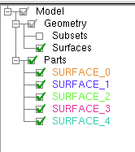
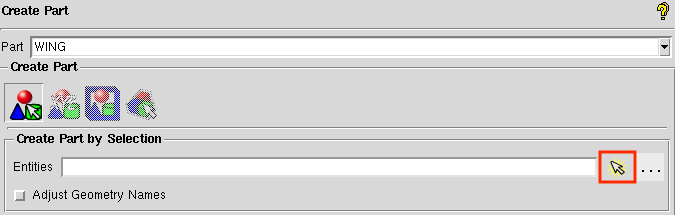
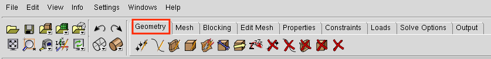

.. centered::
    :ref:`aero_pygeo` | :ref:`aero_pyhyp`

.. _aero_icem:

***************
Surface Meshing
***************

Introduction
================================================================================
The objective of this section is to familiarize the user with the ICEM CFD software and to create a surface mesh.
ICEM CFD is a meshing software with advanced CAD/geometry readers and repairs tools.
It allows the user to produce volume or surface meshes.
At times ICEM may test your patience, however, it offers a lot of functionality and is quite handy once you get to know its quirks.

.. warning:: Make sure you save your work often when using ICEM. It is known to crash at the worst possible moments. We also recommend saving instances of a single project in different locations just in case you need to go back to a previous state.

Files
================================================================================
Navigate to the directory ``aero/meshing/surface`` in your tutorial folder.
Copy the following files from the the ``geometry`` directory:
::

    $ cp ../../geometry/wing.tin .

Basic ICEM Usage
================================================================================
This section contains some general usage information that will helpful in becoming familiar with ICEM.
The actual tutorial starts with :ref:`surface_meshing`.

Opening ICEM
------------
First determine where the ICEM executable is located
::

    $ which icemcfd
    /usr/ansys_inc/v150/icemcfd/linux64_amd/bin/icemcfd

Then run the executable with superuser privileges
::

    $ sudo /usr/ansys_inc/v150/icemcfd/linux64_amd/bin/icemcfd

File Types
----------
ICEM uses several native file types with the following extensions:

.prj
    Project file. Contains references to the geometry and blocking files of the same name.

.tin
    Geometry file. Contains a geometry definition made up of points, lines, and surfaces.

.blk
    Blocking file. Contains the definition of the geometry and parameters used to generate the mesh.

Navigating in ICEM
------------------
To adjust your view of the geometry in ICEM the following functions are possible with the mouse:

- Hold down left button while dragging mouse: Rotate the view in 3D space
- Hold down middle button while dragging mouse: Translate view in viewing plane
- Scroll middle button: Slow zoom in/out
- Hold down right button
    - Drag mouse up/down: Fast zoom
    - Drag mouse left/right: Rotate view in viewing plane

.. _icem_appearance:

Changing the appearance of the geometry
---------------------------------------
.. image:: images/icem_AppearanceButtons.png
   :scale: 80

The two buttons outlined in red can be used to view the geometry as a wire frame (left button) or a collection of opaque surfaces (right button).

.. _surface_meshing:

Creating a surface mesh
================================================================================

Load the geometry
-----------------
In ICEM, select ``File`` → ``Geometry`` → ``Open Geometry``.

Navigate to the surface meshing folder and open ``wing.tin``.

ICEM will prompt you to create a project called ``wing.prj``. Select Yes.

Rename Parts
------------
You will see in the model tree that there are 5 different parts with arbitrary names.
We want to redefine a single part that contains all wing geometry and call it WING.

Right-click on ``Parts`` in the model tree and select ``Create Part``.
The options for creating a new part will appear in the lower left-hand pane as shown below.
Change the name from "PART.1" to "WING".
We want to create the "WING" part by selecting objects in the viewing pane.
To do this, select the arrow to the left of the ``Entities`` box (outlined in red) and then drag a box (with the left mouse button) over all the wing surfaces in the viewing pane.
All of the selected geometry should become highlighted.
Now click the center mouse button to verify the operation.
All of the selected components should become the same color, and a new part called "WING" should appear in the model tree under ``Parts``.
To refresh the model tree, deselect and then reselect the checkbox next to the "WING" part.
This should make all of the other parts go away.

Auxiliary Geometry
------------------
Before actually creating the mesh, it is helpful to create some additional geometric features to use as references for the mesh.
All geometry creation and manipulation is done under the ``Geometry`` tab, outlined in red in the image below.

1. Create curves and points from surfaces.
~~~~~~~~~~~~~~~~~~~~~~~~~~~~~~~~~~~~~~~~~~
    You will notice that the geometry section of the model tree contains only Subsets and Surfaces.
    We want to see the curves and points that define the boundaries of these surfaces.
    This can be done by clicking on the ``Repair Geometry`` button in the ``Geometry`` tab.

    The ``Repair Geometry`` section will open up in the lower left pane.
    The default operation in this section is ``Build Diagnostic Topology`` (outlined in blue).
    This will create the curves and points that define the surface intersections, if they are missing.
    Click ``Apply`` at the bottom of the pane (the default options should be sufficient).
    You will see red and yellow curves appear on the geometry.
    The red curves denote an intersection between two surfaces and the yellow curves denote unattached surface edges.
    Additionally, points appear at the corners of the surfaces.
    If you look at the model tree now, you should see Subsets, Points, Curves, and Surfaces under the Geometry branch and a single part named "WING" in the Parts branch.

    .. image:: images/icem_ModelTree2.png
       :scale: 80

    There are some curves and points missing still.
    If you look closely at the trailing edge of the wing, you will see that only one curve was made when we repaired the geometry.
    This is because the lower surface of the wing is continuous with the trailing edge surface, so there is no intersection.
    We need to make a curve to define the lower edge of the trailing edge.
    First we need to create some points.
    To do this, let's go to the ``Create Point`` button of the ``Geometry`` tab and then select ``Curve Ends`` in the lower left pane.

    .. image:: images/icem_PointsCurveEnds.png
       :scale: 80

    Select "both" in the ``How`` drop-down menu and then click the arrow to the right of the ``Curve(s)`` box.
    Now select the curve on the upper edge of the trailing edge and the lower surface curves at the root and tip of the wing.
    Now let's go to the ``Create/Modify Curve`` button of the ``Geometry`` tab.

    .. image:: images/icem_CurveFromPoints.png
       :scale: 80

    Select the first option in the lower left pane (``From Points``).
    This will create a straight line between two points or a spline between multiple points.
    Select the arrow to the right of the ``Points`` box and then choose the points at either end of the lower edge of the trailing edge.
    For good measure, you can close off the trailing edge by creating curves between the upper and lower surfaces at the root and tip of the trailing edge.
    In the end, your trailing edge should look like this (only Curves and Points are turned on in the Geometry tree).

    .. image:: images/icem_TrailingEdgeCurves.png
       :scale: 30

2. Create auxiliary curves
~~~~~~~~~~~~~~~~~~~~~~~~~~
    Now let's create some curves to help define the leading edge section of the surface mesh.
    First we need to create some points, so go back to the ``Create Point`` section.
    This time select the ``Parameter along a Curve`` operation.

    .. image:: images/icem_PointsParameter.png
       :scale: 80

    Put 0.01 in the ``Parameters`` box and then click the arrow to the right of the ``Curve`` box.
    Now select the upper and lower airfoil curves at the wingtip.
    You should see two points appear near the leading edge.
    For the root airfoil section, the curves are flipped, so we need to enter 0.99 in the ``Parameters`` box and then select the upper and lower curves just like we did for the wingtip.

    Now we need to connect these points with curves.
    Go back to the ``Create/Modify Curve`` button under the ``Geometry`` tab and select the ``From Points`` operation.
    Connect the points on the upper surface with one line and the points on the lower surface with another line.
    Now the leading edge of your wing should look like this:

    .. image:: images/icem_LeadingEdgeCurves.png
       :scale: 30

Blocking
--------
The blocking is the underlying structure that defines the mesh.
In the blocking we can define how many cells we want and how we want them to be arranged.

1. Create 3D blocking with bounding box
~~~~~~~~~~~~~~~~~~~~~~~~~~~~~~~~~~~~~~~
    The best way to create the blocking is to first create a 3-D bounding box and to then convert that blocking from 3-D to 2-D.
    This approach is preferred as it helps ICEM understand the topology, often preventing future issues.

    To do this, under the ``Blocking`` tab, select the first icon, ``Create Block`` shown here:

    .. image:: images/icem_TabBlocking.png
        :scale: 80

    This opens a menu in the lower left corner of the window.
    With the default options, click the button next to the input box for the entities (if it was not automatically selected).
    This button allows you to select the entities you want to create a blocking for from the CAD model.
    Directions for selecting entities are found in red text at the bottom of the CAD window.
    To create a bounding box around the entire wing, select all of the wing entities by clicking and dragging with the left mouse button.

    .. image:: images/icem_CreateBlock.png
        :scale: 80

2. Convert 3D blocking to 2D blocking
~~~~~~~~~~~~~~~~~~~~~~~~~~~~~~~~~~~~~
    Now the 3-D bounding box needs to be converted to a 2-D blocking (as we only want a surface mesh output from ICEM).
    To do this, select the fifth icon in the ``Create Block`` menu (shown below).

    .. image:: images/icem_Blocking3Dto2D.png
        :scale: 80

    After selecting the fifth icon, select OK or Apply at the bottom of the Create Block menu.
    If the conversion was successful, in the dialog box there will be a message reading "...Blocking successfully converted to 2D..."

    Look back at the model tree and you should see something like this (expand the Blocking tab).

    .. image:: images/icem_ModelTree3.png
        :scale: 80

    If you check the box next to ``Blocks``, you will see yellow surfaces appear surrounding the wing.
    Since the wing root is on the symmetry plane, we want to remove the block along the symmetry plane.
    This can be done with the ``Delete Block`` button in the ``Blocking`` tab.
    Check the box for "Delete permanently" and then select the yellow surface parallel with the root airfoil.
    It should become highlighted like in the image below.

    .. image:: images/icem_DeleteBlock.png
        :scale: 30

    To complete the operation, click the middle mouse button.

3. Associate blocking to geometry
~~~~~~~~~~~~~~~~~~~~~~~~~~~~~~~~~
    In order to control the shape of the surface mesh, we can associate the block edges to curves on the geometry.
    We can do this with the ``Associate`` button in the ``Blocking`` tab.
    First, let's associate the vertices of the blocks to points on the geometry.

    .. image:: images/icem_AssociateVertex.png
        :scale: 80

    The first operation in the ``Associate`` pane allows us to associate vertices to points, curves, or surfaces.
    We want to associate the 8 vertices to the corresponding 8 points at the corners of our wing.
    Click the arrow to the right of the ``Vertex`` box.
    The first selection in the view pane will choose the vertex and the second selection will choose the point to which it will be associated.
    The association will happen immediately and the vertex should move to the same location as the point.
    You can continue selecting vertex and point pairs until you are done.
    After associating the vertices at the wing root, the blocking should look like this.

    .. image:: images/icem_AssociatedVertices.png
        :scale: 30

    Now do the same thing at the wing tip.

    The next step is to associate the block edges to the geometry.
    Go to the second button in the ``Associate`` pane: ``Associate Edge to Curve``.
    Now select the upper edge at the symmetry plane and then select the upper curve of the root airfoil.
    You must confirm each selection by clicking the middle mouse button.
    After the edge is associated, it should turn green.
    Do the same thing with the lower edge and the lower curve of the root airfoil.
    For the vertical edge at the leading edge of the root, we need to associate to both the upper and lower root airfoil curves.
    First select the edge and confirm, and then select both airfoil curves and confirm.

    Let's check out the state of the mesh at this point.
    We can view the mesh by checking the box next to ``Pre-Mesh`` in the ``Geometry`` branch of the model tree.
    If you are in wire mesh view, switch to a solid surface view (see :ref:`icem_appearance`).
    You will see that the mesh is collapsed in on itself (don't worry, we'll fix it in the next step).

4. Split and adjust edges
~~~~~~~~~~~~~~~~~~~~~~~~~
    To remedy the collapsed mesh, we need to create some control points along the edges.

    .. image:: images/icem_EditEdge.png
        :scale: 80

    Go to the ``Edit Edge`` button in the ``Blocking`` tab.
    Under the ``Split Edge`` operation, choose the "Linear" method.
    Then click the arrow to the right of the ``Edge`` box and select the upper horizontal edge at the symmetry plane.
    Immediately, a point will snap to the associated curve (make sure you drag it up to the upper curve of the airfoil before you let go).
    Once you let go of the mouse button, a dialog box will pop up with the following message:

    .. image:: images/icem_UpdatePreMesh.png
        :scale: 80

    Select "Yes" and you will see the mesh snap up to the upper surface.
    You can add a couple more control points to the upper edge and then do the same for the lower horizontal edge.

    Now we want to do the same thing for the wingtip.

5. Define edge properties
~~~~~~~~~~~~~~~~~~~~~~~~~

6. Split Block
~~~~~~~~~~~~~~

7. Check mesh quality
~~~~~~~~~~~~~~~~~~~~~

8. Ensure correct block orientation
~~~~~~~~~~~~~~~~~~~~~~~~~~~~~~~~~~~

Convert to MultiBlock Mesh
--------------------------

Export the mesh
---------------
Export the mesh to a cgns file named 'wing.cgns'.

.. centered::
    :ref:`aero_pygeo` | :ref:`aero_pyhyp`
