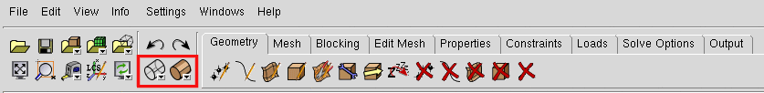
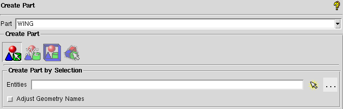

.. centered::
    :ref:`aero_pygeo` | :ref:`aero_pyhyp`

.. _aero_icem:

***************
Surface Meshing
***************

Introduction
================================================================================
The objective of this section is to familiarize the user with the ICEM CFD software and to create a surface mesh.
ICEM CFD is a meshing software with advanced CAD/geometry readers and repairs tools.
It allows the user to produce volume or surface meshes.
At times ICEM may test your patience, however, it offers a lot of functionality and is quite handy once you get to know its quirks.

Basic ICEM Usage
================================================================================
Opening ICEM
------------
First determine where the ICEM executable is located
::

    $ which icemcfd
    /usr/ansys_inc/v150/icemcfd/linux64_amd/bin/icemcfd

Then run the executable with superuser privileges
::

    $ sudo /usr/ansys_inc/v150/icemcfd/linux64_amd/bin/icemcfd

File Types
----------
ICEM uses several native file types with the following extensions:

.prj
    Project file. Contains references to the geometry and blocking files of the same name.

.tin
    Geometry file. Contains a geometry definition made up of points, lines, and surfaces.

.blk
    Blocking file. Contains the definition of the geometry and parameters used to generate the mesh.

Navigating in ICEM
------------------
To adjust your view of the geometry in ICEM the following functions are possible with the mouse:

- Hold down left button while dragging mouse: Rotate the view in 3D space
- Hold down middle button while dragging mouse: Translate view in viewing plane
- Scroll middle button: Slow zoom in/out
- Hold down right button
    - Drag mouse up/down: Fast zoom
    - Drag mouse left/right: Rotate view in viewing plane

Changing the appearance of the geometry
---------------------------------------

The two buttons outlined in red can be used to view the geometry as a wire frame (left button) or a collection of opaque surfaces (right button).

Creating a surface mesh
================================================================================

Load the geometry
-----------------
In the terminal, navigate to the surface meshing directory and copy ``wing.tin`` from the geometry directory.
::

    $ cd my_tutorial/aero/meshing/surface
    $ cp ../../geometry/wing.tin .

In ICEM, select File → Geometry → Open Geometry.

Navigate to the surface meshing folder and open ``wing.tin``.

ICEM will prompt you to create a project called ``wing.prj``. Select Yes.

Rename Parts
------------
You will see in the model tree that there are 5 different parts with names that do not provide meaning.
We want to redefine a single part that contains all wing geometry and call it WING.

.. figure:: figures/aero/meshing/surface/model_tree1.png
   :scale: 100
   :align: center
   :alt: alternate text
   :figclass: align-center

Right-click on ``Parts`` in the model tree and select ``Create Part``.
The options for creating a new part will appear in the lower left-hand pane as shown below.
Change the name from ``PART.1`` to ``WING``.
We want to create the ``WING`` part by selecting objects in the viewing pane.
To do this, select the arrow to the left of the ``Entities`` box (outlined in red) and then drag a box (with the left mouse button) over all the wing surfaces in the viewing pane.
All of the selected geometry should become highlighted.
Now click the center mouse button to verify the operation.
All of the selected components should become the same color, and a new ``WING`` part should appear in the model tree under ``Parts``.

On Figure 1 is highlighted (red circle) the mains tabs used for this meshing tutorial.

.. figure:: Pic/Aero/Icem/img1.png
   :width: 750px
   :align: center
   :height: 200px
   :alt: alternate text
   :figclass: align-center

   Figure 1

Check out now the view icons and try to un/select surface in the geometry branch with Solid full flat display mode.

.. figure:: Pic/Aero/Icem/img2.png
   :width: 200px
   :align: center
   :height: 50px
   :alt: alternate text
   :figclass: align-center

   Figure 2

Create an auxiliary curves on the leading edge
==============================================
Select Geometry label →  Create Curve →  Isoparametric (Surface parameter). Set V=0.98 then click on  select all upper and lower surfaces by dragging the mouse and apply (middle mouse click).

.. figure:: Pic/Aero/Icem/img2b.png
   :width: 200px
   :align: center
   :height: 250px
   :alt: alternate text
   :figclass: align-center

   Figure 2b

Merge all components in a single part
=====================================
In ICEM Tree → Part : create new part (right click on part). Name the new part 'wing' like on figure 3a. Then activate everything on the geometry branch. Click on Create Part by selection, select everything on the screen by dragging the mouse and confirm. Everything should have a single color now like on Figure 3b.

.. figure:: Pic/Aero/Icem/img3.png
   :width: 200px
   :align: center
   :height: 100px
   :alt: alternate text
   :figclass: align-center

   Figure 3a

.. figure:: Pic/Aero/Icem/img3b.png
   :width: 400px
   :align: center
   :height: 400px
   :alt: alternate text
   :figclass: align-center

   Figure 3b

Initialize 3D Bounding box
==========================
Select Blocking label →  Create Block →  Initialize Blocks. Change the part name to FLUID (see figure 3c).
Then click on 3D Bounding Box, select all entities and click with the middle mouse click. It will create the block.

.. figure:: Pic/Aero/Icem/IMG4.png
   :width: 200px
   :align: center
   :height: 200px
   :alt: alternate text
   :figclass: align-center

   Figure 3c

Convert 3D to 2D mesh (specify the generation of a surface mesh)
=================================================================
Select Blocking label →  Create Block →  Convert Blocking 3D to 2D and apply.

*Suggestion: it happens that ICEM  stops working especially after using multiple times the undo icons. So don’t forget to save your work. Also, each time you save, you can save it with a different name in order for you to go back to a previous step.*

Split the wing block in different parts
=======================================
Select Blocking label → Split block → Split block then create a split near the kink(s) (see Figure 4)

.. figure:: Pic/Aero/Icem/IMG6.png
   :width: 500px
   :align: center
   :height: 500px
   :alt: alternate text
   :figclass: align-center

   Figure 4

Delete block on the root
========================
Inside the ICEM tree, select:

* Geometry → all the objects (subsets, curves, block, surfaces)
* Blocking → edges & blocks

Now, click on Blocking label → Delete block. Then select the block on the root highlighted in black on Figure 5 and delete it. If you cannot select it, try to do it from the opposite side.

.. figure:: Pic/Aero/Icem/IMG7.png
   :width: 500px
   :align: center
   :height: 500px
   :alt: alternate text
   :figclass: align-center

   Figure 5

Associate vertex to point and edge to curve
============================================
Select Blocking label →  Associate → Associate edge to curve

.. figure:: Pic/Aero/Icem/IMG8a.png
   :width: 500px
   :align: center
   :height: 500px
   :alt: alternate text
   :figclass: align-center

   Figure 6

Inside the red square (left side) on Figure 6, you have two icons used for association. The left one is used to associate vertex to point.
The Right one is used to associate edge to curve.

In ICEM tree, check if all the Geometry objects from subsets up to surfaces are selected. If not select them. Do the same for the vertices and edges in the Blocking branch.

Associate each block with the corresponding vertex for the root: select an edge of the root section (Figure 8: upper edge in red), then middle mouse click (MMC).Then select the root airfoil curves corresponding to it (Figure 8, upper curve in green of the airfoil), then MMC. Do the same for each curve on the airfoil. Associate the lower edge with the lower curve, the trailing edge with the trailing curve and so on.

.. figure:: Pic/Aero/Icem/IMG8c.png
   :width: 500px
   :align: center
   :height: 500px
   :alt: alternate text
   :figclass: align-center

   Figure 8

Repeat for the other sections:

* Tip
* Leading edge curves (v=0.98 curves)
* Trailing edge curves

Verification of the association
===============================
Click right on Edges (see Figure 9) in the Blocking branch (ICEM tree) and select show association.

.. figure:: Pic/Aero/Icem/IMG10.png
   :width: 500px
   :align: center
   :height: 500px
   :alt: alternate text
   :figclass: align-center

   Figure 9

Create points at the curves V=0.98
==================================
Select Geometry label → Create points → Curve intersection. Then create points at the auxiliary curves on the root and the tip (see Figure 10a).

.. figure:: Pic/Aero/Icem/IMG11.png
   :width: 500px
   :align: center
   :height: 500px
   :alt: alternate text
   :figclass: align-center

   Figure 10a

.. figure:: Pic/Aero/Icem/IMG11b.png
   :width: 500px
   :align: center
   :height: 500px
   :alt: alternate text
   :figclass: align-center

   Figure 10b

For the middle section's kink use the screen select point and add a point at the leading edge and the trailing edge kink. Then select the point projection icon Figure 10b. Select a v=0.98 curve and the point on the leading edge in order to create a new point (same for the other curve). Repeat the process for the trailing edge.

Associate vertices to points
============================
Select Blocking tab → Associate → Associate vertex. Then select the vertex and the associated point. Do the association for the vertices on the trailing edge (TE) and the leading edge (LE) too. For the leading edge, you want to associate each vertex on the box forefront to the points on the respective V=0.98 curve created before (not to the leading edge). Also, watch out to associate correctly the vertex on the top (resp. bottom) of the box with the upper wing (resp. under wing).

.. figure:: Pic/Aero/Icem/IMG12a.png
   :width: 500px
   :align: center
   :height: 500px
   :alt: alternate text
   :figclass: align-center

   Figure 11a: before vertex association, blocks visualization.

.. figure:: Pic/Aero/Icem/IMG12b.png
   :width: 500px
   :align: center
   :height: 500px
   :alt: alternate text
   :figclass: align-center

   Figure 11b: after vertex association, blocks visualization.

Pre mesh/ visualization
=======================
Select in Blocking branch → Pre-mesh object. From this step on, everything is ready to attack final step for the meshing part of the tutorial. As the mesh is really coarse we want to adjust the number of nodes.

Nodes adjustment and finer mesh
===============================
select Blocking label → Pre-mesh params → Edge params (see Figure 13)

.. figure:: Pic/Aero/Icem/img13.png
   :width: 200px
   :align: center
   :height: 300px
   :alt: alternate text
   :figclass: align-center

   Figure 13

First, you select the edge, by clicking on it. You may want to hide the mesh by unselecting the Pre-mesh in the blocking branch.

* From the root to the tip you want a distribution alongside the LE close to this one:

    * Root spanwise part (64+1) 65.
    * Extern part of the wing  (256+1) 257 nodes.

* For the airfoils distributions : the upper part and the lower part around 129 nodes.

For updating the mesh un/select Pre-mesh in the blocking branch.

.. figure:: Pic/Aero/Icem/IMG14.png
   :width: 500px
   :align: center
   :height: 500px
   :alt: alternate text
   :figclass: align-center

   Figure 14

**Try to find out the use of all the options:**
First the ratio, then spacing 1 & 2, and finally the Sp1 & Sp2 link. The orientation of the spacing 1/2 & Sp1/Sp2 is given by the arrow direction:
* 1 for the start
* 2 for the end

The Sp1/Sp2 link is used to link the edge with another one connected to it.

.. figure:: Pic/Aero/Icem/img15.png
   :width: 500px
   :align: center
   :height: 300px
   :alt: alternate text
   :figclass: align-center

   Figure 15

Wing's tip
==========
For the wing's tip, you may want to have a curved edge in order to better fit the mesh and take into account the curvature of the airfoil. In order to do that select Blocking→ Edit edge → Split edge. To make a curve: divide the edge associated to the airfoil (on the wing's tip) upper part and split it like on Figure 16. Do the same for the lower part.

.. figure:: Pic/Aero/Icem/img16.png
   :width: 500px
   :align: center
   :height: 500px
   :alt: alternate text
   :figclass: align-center

   Figure 16

Again select Blocking label → Associate → Associate edge to curve and redo the association. Then update the mesh by un/selecting Pre-mesh and adjust the ratios, max values, etc until you found a decent mesh.

.. figure:: Pic/Aero/Icem/img17.png
   :width: 500px
   :align: center
   :height: 500px
   :alt: alternate text
   :figclass: align-center

   Figure 17

Check the normals
=================
Select Blocking label → Edit Block → Change block IJK. If there are red faces outside (Figure 18), you need to reverse the normals. Once reversed, only green faces should be visible on the outside (Figure 19).

.. figure:: Pic/Aero/Icem/IMG16a.png
   :width: 500px
   :align: center
   :height: 500px
   :alt: alternate text
   :figclass: align-center

   Figure 18

.. figure:: Pic/Aero/Icem/IMG16b.png
   :width: 500px
   :align: center
   :height: 500px
   :alt: alternate text
   :figclass: align-center

   Figure 19

Check quality
=============
Select Blocking tab → Pre-mesh quality histograms. Select the option:  "determinant 2x2x2". Then set the min to -1 and apply. Select the wire frame simple editor mode and click on the histogram bars to highlight the selected faces. Check if it is above 0.4; if not, adapt the mesh ratio, spacing, etc.

.. figure:: Pic/Aero/Icem/img20.png
   :width: 600px
   :align: center
   :height: 500px
   :alt: alternate text
   :figclass: align-center

   Figure 20

Generate multiblock mesh
========================
ICEM tree → Blocking →  Pre-mesh. Right click on it and choose to convert to multi-block mesh.

Output mesh
===========
Select Output tab → solver. Set up the options:

* Output solver : CGNS
* Common Structural solver: Nastran
* Set as Default

Once set, click apply.

Select Output tab → write input. Set up the options:

* Type of file : select multi-block file
* Choose all domains

For the name of the file put "wing.cgns".

Once set, click apply

.. figure:: Pic/Aero/Icem/output_write_icem.png
   :width: 500px
   :align: center
   :height: 200px
   :alt: alternate text
   :figclass: align-center

   Figure 21

.. centered::
    :ref:`aero_pygeo` | :ref:`aero_pyhyp`
