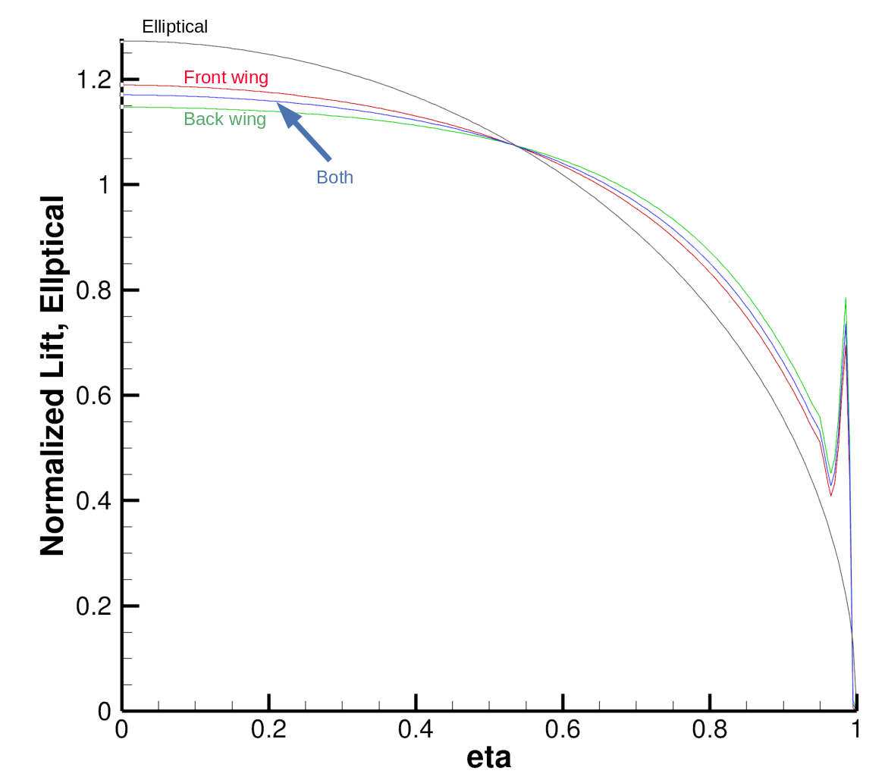

.. centered::
    :ref:`overset_ihcc` | :ref:`overset_ffds`

.. _overset_analysis:

********************
Analysis with ADflow
********************

Introduction
================================================================================
Now we will run a flow simulation with ADflow.

Files
================================================================================
Navigate to the directory ``overset_tutorial/analysis`` in your tutorial folder.
Copy the following files from the volume meshing directory:
::

    $ cp ../mesh/volume/overset_combined.cgns .

Create the following empty runscript in the current directory:

- ``aero_tandem.py``

Dissecting the ADflow runscript
================================================================================
Open the file ``aero_tandem.py`` with your favorite text editor.
Then copy the following code blocks into this file.

.. literalinclude:: ../tutorial/overset_tutorial/analysis/aero_tandem.py
   :start-after: #rst start
   :end-before: #rst end_options

For this case we set the ``MGCycle`` option to ``sg`` (single grid) because we usually avoid using multigrid with overset meshes (problems with hole cutting and connectivities when the overset meshes are coarsened).
We set a large ``ankswitchtol`` so that the ANK solver is used from the beginning instead of DADI or RK.
(Reminder: We strongly recommend going over the descriptions and tips on solvers and solver options in the ADflow `solvers docs <http://mdolab.engin.umich.edu/docs/packages/adflow/doc/solvers.html>`_.)
The overset options are the same as the ones described in :ref:`overset_ihcc` except for `usezippermesh` which is set to ``True`` now.
As mentioned earlier, a zipper mesh provides a watertight surface for force integration in the region where cells overlap.

Next, we use the following options to save separate lift distributions for the front wing, the back wing, and both wings combined.
The ``groupName`` is specified as the family name given to the meshes in :ref:`overset_volume_meshes`.
When the ``groupName`` is not specified, all the wall surfaces are used by default (this gives us the total lift distribution).

.. literalinclude:: ../tutorial/overset_tutorial/analysis/aero_tandem.py
   :start-after: #rst end_options
   :end-before: #rst end_dist

Finally, we call the solver and output the results.

.. literalinclude:: ../tutorial/overset_tutorial/analysis/aero_tandem.py
   :start-after: #rst end_dist
   :end-before: #rst end

Run it yourself!
================================================================================
Run the script:
::

    $ mpirun -np 4 python aero_tandem.py

Now let's load the .dat file with the lift distributions into Tecplot.
Load ``fc_000_lift.dat`` then click on ``Mapping Style``.
Check the boxes under ``Show Map`` for four rows and change the ``Y-Axis variable`` for three of them to ``Normalized Lift`` and one of them to ``Ellptical``.
For the three with ``Normalized Lift`` change the ``Zone`` so that one shows the font wing, one shows the back wing, and one shows all walls.
We should get something that looks like the following (ctrl+F to fit the curves in the frame) without the labels.

.. centered::
    :ref:`overset_ihcc` | :ref:`overset_ffds`
