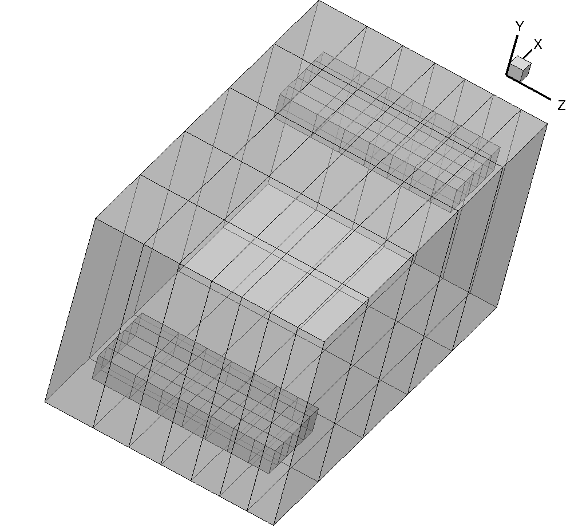

.. centered::
    :ref:`overset_analysis` | :ref:`overset_opt`

.. _overset_ffds:

******************
Creating FFD Grids
******************

Introduction
================================================================================
Before moving on to the optimization runscript, we need to create FFD grids.
We will use a similar custom script to the one used in :ref:`opt_ffd`.

Files
================================================================================
Navigate to the directory ``oversetopt/ffd`` in your tutorial folder.
Create the following empty runscript in the current directory:

- ``tandem_ffds.py``

Custom runscript to create FFD grids
================================================================================
Open the file ``tandem_ffds.py`` with your favorite text editor.
Then copy the following code blocks into this file.

First we will create a grid around the front wing.

.. literalinclude:: ../tutorial/oversetopt/ffd/tandem_ffds.py
   :start-after: #rst start
   :end-before: #rst front_end

Then we will use the same approach to create a grid for the back wing.

.. literalinclude:: ../tutorial/oversetopt/ffd/tandem_ffds.py
  :start-after: #rst front_end
  :end-before: #rst back_end

Finally, we will create a large grid that envelopes the two grids created for the wings.
Later, in the optimization runscript, we will set the wing FFDs as children FFDs to this larger global FFD.
This is one approach for setting up the FFDs for multiple surfaces.

This global grid must be large enough that the child FFD grid points stay inside it.
For this case, the grid actually just needs to be 4 corner points (instead of the 6 x 2 x 8 grid that we create here by recycling the same code used above, but it doesn't matter if we have more points).

.. literalinclude:: ../tutorial/oversetopt/ffd/tandem_ffds.py
  :start-after: #rst back_end
  :end-before: #rst end

Run it yourself!
================================================================================
Run the script:
::

    $ python tandem_ffds.py

Loading the three grids in Tecplot should look something like this with translucency.

.. centered::
    :ref:`overset_analysis` | :ref:`overset_opt`
