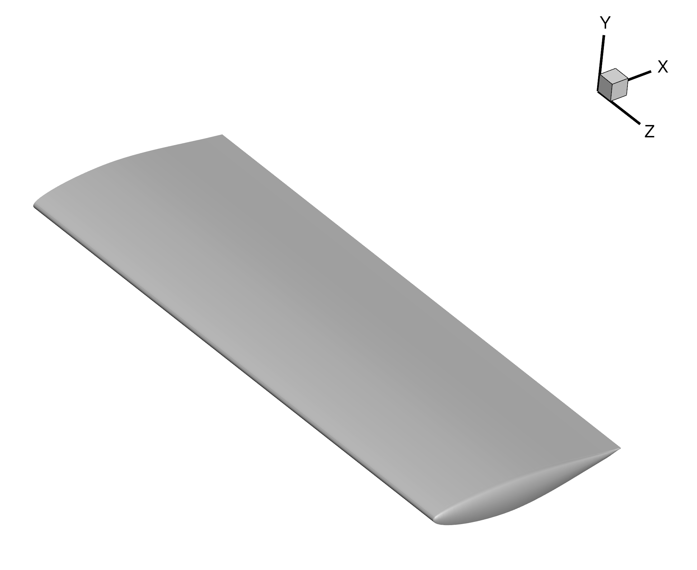
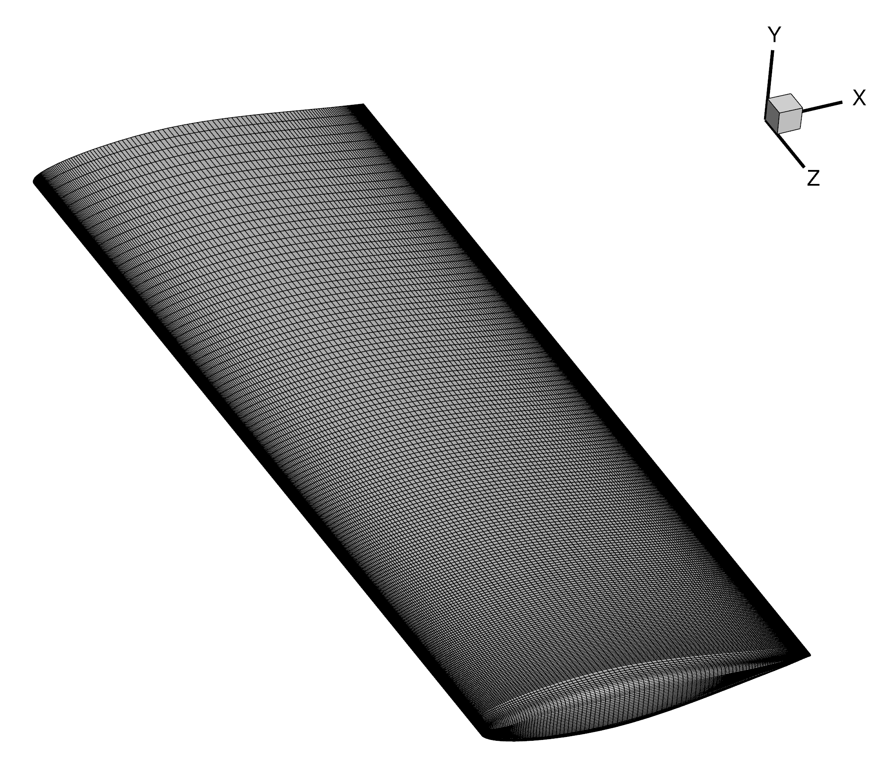

.. centered::
    :ref:`overset_overview` | :ref:`overset_volume_meshes`

.. _overset_geom:

************************************
Geometry and Surface Mesh Generation
************************************

Introduction
================================================================================
First we will generate a simple rectangular wing geometry using the same process covered earlier in the :ref:`aero_pygeo` tutorial, but with a different planform and airfoil.
Then we will generate a surface mesh using the same process covered earlier in the :ref:`aero_icem` tutorial.

Files for geometry generation
================================================================================
Navigate to the directory ``overset_tutorial/geometry/`` in your tutorial folder.
Copy the following files from the MACHtutorial repository:
::

    $ cp MACHtutorial/tutorial/overset_tutorial/geometry/NACA642A015.dat .

Create the following empty runscript in the current directory:

- ``generate_wing.py``

The pyGeo runscript
================================================================================
Open the file ``generate_wing.py`` in your favorite text editor.
Then copy the following into this file.

.. literalinclude:: ../tutorial/overset_tutorial/geometry/generate_wing.py
   :start-after: #rst start
   :end-before: #rst end

This will generate a small (0.24 m x 0.64 m) rectangular wing with a NACA 642-A015 airfoil.

Run it yourself!
================================================================================
After copying ``NACA642A015.dat`` to your ``overset_tutorial/geometry`` folder and making the ``generate_wing.py`` script, you can now run the python file with the command:
::

    $ python generate_wing.py

You can open ``wing.dat`` in Tecplot to view the wing surface.

Surface mesh
================================================================================

Now navigate to your ``overset_tutorial/mesh/surface`` folder and create a surface mesh for this geometry using the same process covered in :ref:`aero_icem`.
Or if you want to skip this step, you can use the ``wing.cgns`` surface mesh from ``MACHtutorial/tutorial/overset_tutorial/mesh/surface``.

You can open ``wing.cgns`` in Tecplot to view the surface mesh.
There is certainly some room for improvement in the example mesh shown below.

.. centered::
    :ref:`overset_overview` | :ref:`overset_volume_meshes`
