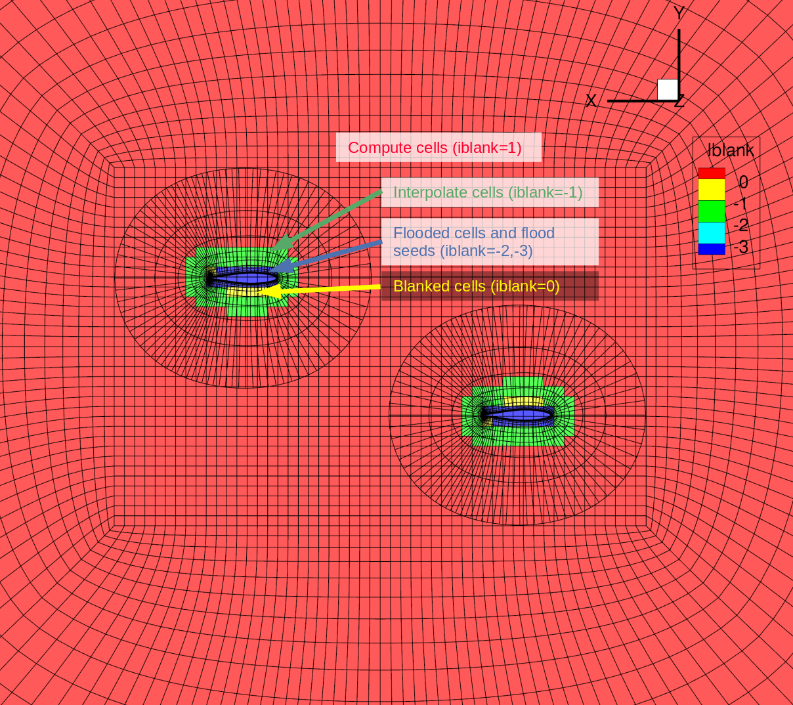
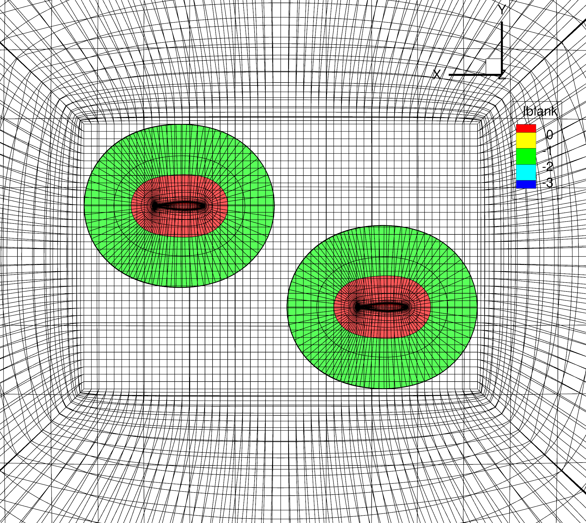

.. centered::
    :ref:`overset_volume_meshes` | :ref:`overset_analysis`

.. _overset_ihcc:

*************************
Checking the Overset Mesh
*************************

Introduction
================================================================================
Getting different meshes that are overset to work well together can be tricky.
Here we will show how ADflow can be used to check if there will be any problems with connectivities.

Files
================================================================================
Navigate to the directory ``overset_tutorial/ihc_check`` in your tutorial folder.
Copy the following files from the volume meshing directory:
::

    $ cp ../volume/overset_combined.cgns .

Create the following empty runscript in the current directory:

- ``ihc_check.py``


Dissecting the ADflow runscript
================================================================================
Open the file ``ihc_check.py`` with your favorite text editor.
Then copy the following ainto this file.


.. literalinclude:: ../tutorial/overset_tutorial/ihc_check/ihc_check.py
   :start-after: #rst start
   :end-before: #rst end


Run it yourself!
================================================================================
Run the script:
::

    $ python ihc_check.py

Visualizing the iblank values in tecplot
================================================================================

  - Load ``overset_combined_IHC.cgns``.
  - Check ``Advanced options`` and click ``Open``.
  - Select ``One Tecplot zone per non-poly CGNS zone/solution``.
  - Check ``Mesh`` under ``Show zone layers``.
  - Zoom in to the symmetry plane.
  - Check ``Contour`` under ``Show zone layers``.
  - Click on ``Details...`` next to ``Contour``.
  - Select ``iblank`` in drop-down menu at the top left.
  - Click on ``Set levels...``` and set levels to a minimum of -3 and a maximum of 0.
  - Set the number of levels to 4 levels, then click ``OK`` and ``Close``.
  - Click on ``Zone Style...``, go to the ``Contour`` tab, then highlight all the zones (ctrl+A) and change the ``Contour Type`` to ``Primary value flood`` (right click).
  - Unckeck (under the ``Show Contour`` column) all the zones with ``wing_vols_combine`` and then click ``Close``.
  - Finally, unselect ``Shade`` under ``Show zone layers`` if it was selected by default.



Now check all zones with ``background`` and unselect all zones with ``wing_vols_combine``.



.. centered::
    :ref:`overset_volume_meshes` | :ref:`overset_analysis`
