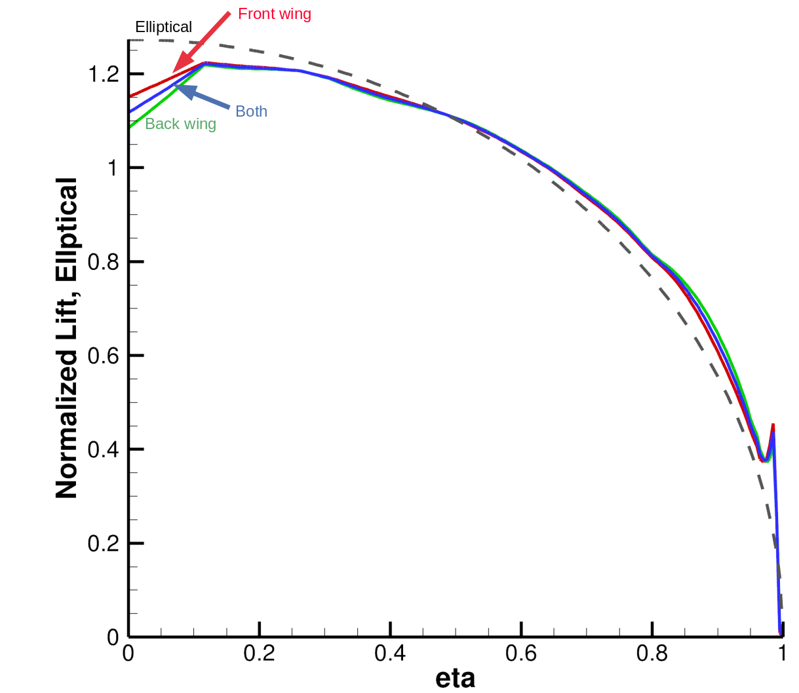

.. centered::
    :ref:`overset_ffds` | :ref:`intro`

.. _overset_opt:

************************
Optimization with ADflow
************************

Introduction
================================================================================
He we will set up a twist and shape optimization case for both wings with ADflow.

Files
================================================================================
Navigate to the directory ``overset_tutorial/opt`` in your tutorial folder.
Copy the following files from the volume meshing directory:
::

    $ cp ../mesh/volume/overset_combined.cgns .

Copy the following files from the FFDs directory:
::

    $ cp ../ffd/ffd_front_wing.xyz .
    $ cp ../ffd/ffd_back_wing.xyz .
    $ cp ../ffd/ffd_global.xyz .

Create the following empty runscript in the current directory:

- ``aero_opt_tandem.py``

Dissecting the ADflow runscript
================================================================================
Open the file ``aero_opt_tandem.py`` with your favorite text editor.
Then copy the following code blocks into this file.

First, as usual we have the initial imports and options.
All these options should be familiar at this point.
You may notice that we haven't specified any overset options here.
This is because the default values for the overset options work for us.

.. literalinclude:: ../tutorial/overset_tutorial/opt/aero_opt_tandem.py
   :start-after: #rst start
   :end-before: #rst initial
   
Next we specify ``alpha`` as a design variable and instantiate DVGeometry objects.
For the front and back wings, we specify their FFD grid-file names and also specify that they are ``child`` FFDs.
For the global FFD, we use ``.addChild()`` to provide the front and back wing DVGeometry objects as child FFDs.

.. literalinclude:: ../tutorial/overset_tutorial/opt/aero_opt_tandem.py
   :start-after: #rst initial
   :end-before: #rst dvgeos

Now we create functions for the twist design variables for the front and back wings, and set up the design variables for twist and shape.
After that we only need to use ``.setDVGeo()`` to add the global DVGeometry object.

.. literalinclude:: ../tutorial/overset_tutorial/opt/aero_opt_tandem.py
   :start-after: #rst dvgeos
   :end-before: #rst dvs

Now we can set up the constraints.
For the DVConstraint object, we only need to set the global DVGeometry object using ``.setDVGeo``.
Then we add volume and thickness constraints.
We require separate constraints for the front and back wings.
Most of this should be familiar from the earlier :ref:`opt_aero` tutorial.
When adding the leading and trailing edge constraints using ``addLeTeConstraints()``, we use ``childIdx`` to specify which child geometry the constraints apply to (``childIdx=0`` would mean the first geometry that was added).

.. literalinclude:: ../tutorial/overset_tutorial/opt/aero_opt_tandem.py
  :start-after: #rst dvs
  :end-before: #rst dvcons

Finally we have our functions of interest and optimization setting.
We only use ``.addVariablesPyOpt()`` for the global FFD.
The rest should look familiar. 

.. literalinclude:: ../tutorial/overset_tutorial/opt/aero_opt_tandem.py
  :start-after: #rst dvcon
  :end-before: #rst end

Run it yourself!
================================================================================
Run the script:
::

    $ mpirun -np 4 python aero_opt_tandem.py

This will probably take over a day to run on a 4 core desktop computer for the meshes used in this tutorial.
But after a few iterations you can used the saved CGNS solution files and Tecplot to see how the geometry is being changed by the optimizer.

The final optimized lift distributions for this problem will look like the following:

.. centered::
    :ref:`overset_ffds` | :ref:`intro`
