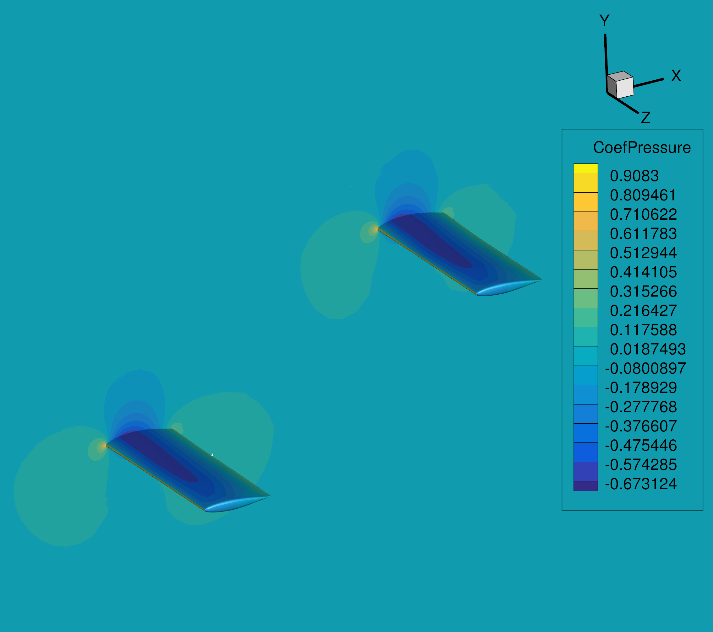

.. centered::
   :ref:`intro` | :ref:`overset_geom`

.. _overset_overview:

#####################################################
Part 6: Analysis and Optimization with Overset Meshes
#####################################################

Overview
================================================================================
In this part of the tutorial, we will look at a tandem-wing case to learn how to generate overset meshes and carry out aerodynamic optimizations with multiple surfaces and FFDs.

Here are a few of the items we will cover in the following pages:

    - Generate geometry and multiple volume meshes for a tandem-wing case

    - Generate a background mesh and combine the meshes

    - Check the overset mesh

    - Run an aerodynamic analysis

    - Generate FFD grids

    - Run an aerodynamic optimization

Table of Contents
================================================================================

.. toctree::
   :maxdepth: 1

   overset_geom
   overset_volume_meshes
   overset_ihcc
   overset_analysis
   overset_ffds
   overset_opt

Directory Structure
================================================================================
::

    oversetopt
    |-- geometry
    |   |-- generate_wing.py
    |   |-- NACA642A015.dat
    |-- mesh
    |   |-- surface
    |       |-- wing.cgns
    |       |-- icem_proj_files
    |   |-- volume
    |       |-- run_pyhyp.py
    |       |-- generate_overset.py
    |-- ihc_check
    |   |-- ihc_check.py
    |-- analysis
    |   |-- aero_tandem.py
    |-- ffd
    |   |-- tandem_ffds.py
    |-- opt
    |   |-- aero_opt_tandem.py

.. centered::
    :ref:`intro` | :ref:`overset_geom`
