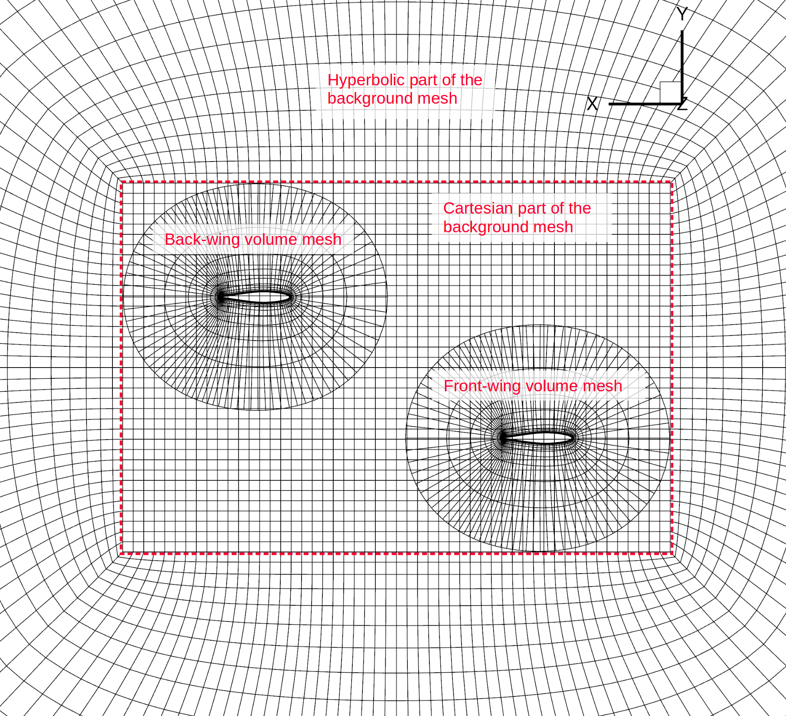
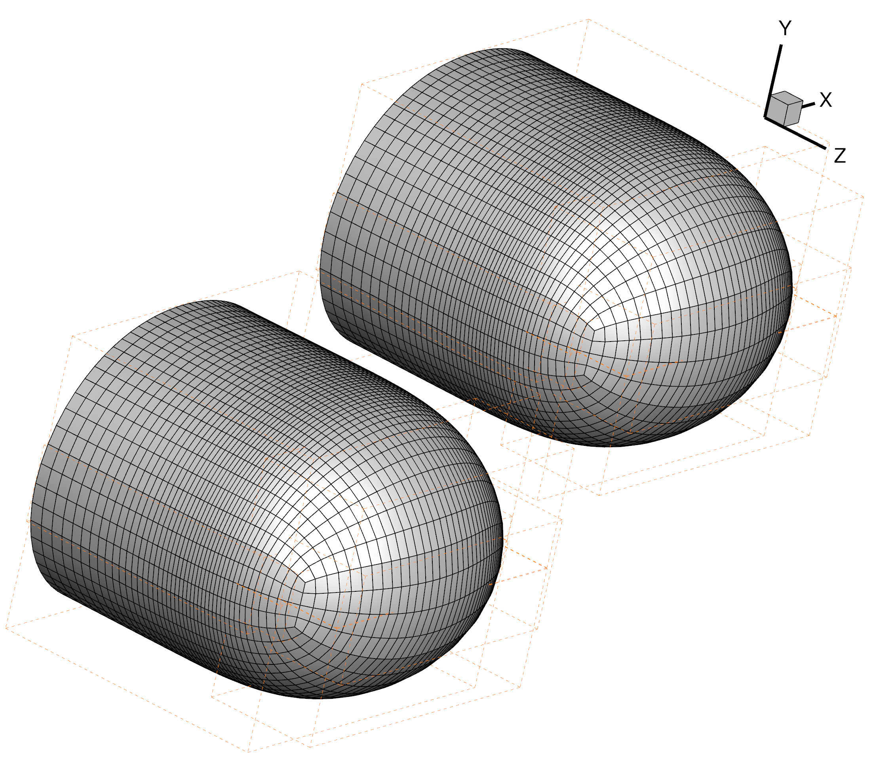
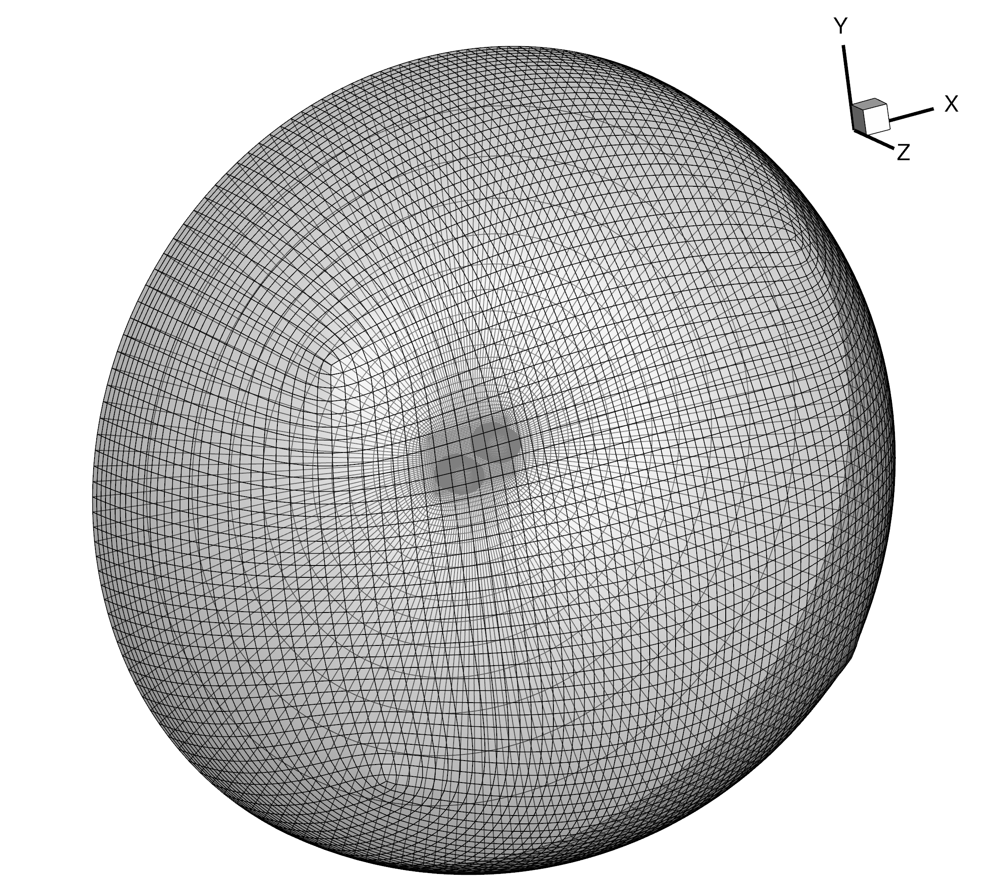
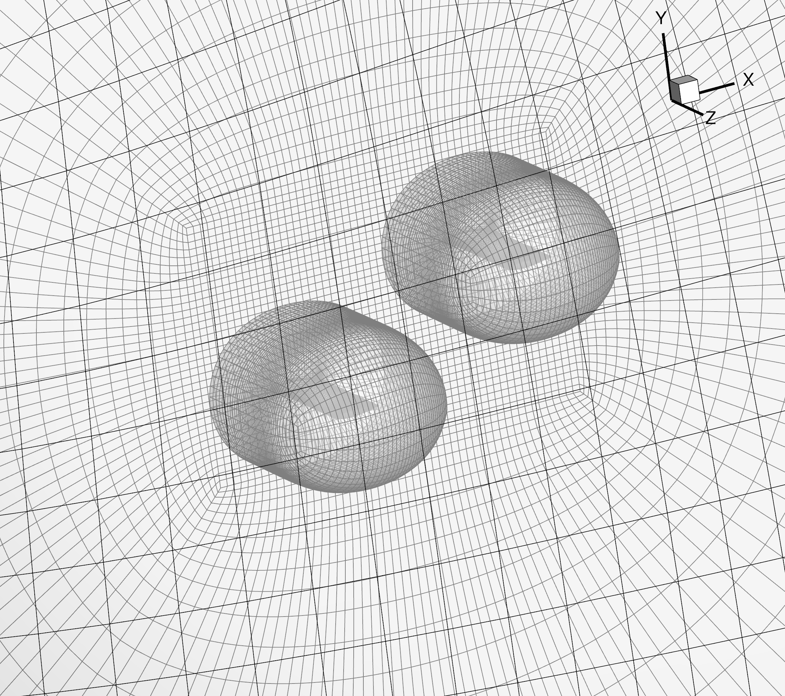

.. centered::
    :ref:`overset_geom` | :ref:`overset_ihcc`

.. _overset_volume_meshes:

**************
Volume Meshing
**************

Introduction
================================================================================
The objective of this section is to:
  - generate two separate volume meshes for the front and back wings,
  - generate a background mesh, and 
  - combine them.

Here is a view of the symmetry plane (looking in the positive-z direction) for what we want for this example.

Once we generate the three meshes, all we need to do is combine them into one CGNS file and ADflow will take care of the connectivities and flooding (when we run an analysis or optimization).

.. note:: TODO: We need to add more background information on overset meshes. In the meantime, see the ``overset.pdf`` slides in ``MACHtutorial/tutorial/oversetopt/``.

Files
================================================================================
Navigate to the directory ``oversetopt/mesh/volume`` in your tutorial folder.
Copy the following files from the surface meshing directory:
::

    $ cp ../surface/wing.cgns .

Create the following empty runscript in the current directory:

- ``run_pyhyp.py``

The pyHyp runscript
================================================================================
Open the file ``run_pyhyp.py`` with your favorite text editor.
Then copy the code from each of the following sections into this file.

Import libraries
----------------
.. literalinclude:: ../tutorial/oversetopt/mesh/volume/run_pyhyp.py
   :start-after: #rst Imports
   :end-before: #rst general

Options for the front wing
--------------------------

.. literalinclude:: ../tutorial/oversetopt/mesh/volume/run_pyhyp.py
    :start-after: #rst general
    :end-before: #rst grid

Here a few options that are different from the options used earlier in :ref:`aero_pyhyp` are the ``outerFaceBC`` and ``families`` options.
Instead of using a farfield boundary condition, we set the ``outerFaceBC`` to ``overset``.
Since we have two wings, we also want to give them different family names that can be used to distinguish between them later for options such as outputting lift distributions from ADflow.
Next we specify some grid parameters.

.. literalinclude:: ../tutorial/oversetopt/mesh/volume/run_pyhyp.py
    :start-after: #rst grid
    :end-before: #rst rest

Here, we specify a relatively small ``marchDist`` because we only need a small volume mesh around the wing surface for the overset mesh.
For this example, we also coarsen the surface mesh before extruding using the ``coarsen`` option.
Next, we have the algorithm-specific options and commands to generate and output the mesh for the front wing.

.. literalinclude:: ../tutorial/oversetopt/mesh/volume/run_pyhyp.py
    :start-after: #rst rest
    :end-before: #rst front_end

Next, we create another volume mesh (same surface file and options but with a different family name) that we will use for the back wing.

.. literalinclude:: ../tutorial/oversetopt/mesh/volume/run_pyhyp.py
    :start-after: #rst front_end
    :end-before: #rst end

Run it yourself!
================================================================================
You can now run the python file with the command:
::

    $ python run_pyhyp.py

For larger meshes, you will want to run pyHyp as a parallel process.
This can be done with the command:
::

    $ mpirun -np 4 python run_pyhyp.py

where the number of processors is given after ``-np``.
Now you will have two CGNS files: ``wing_vol_front.cgns`` and ``wing_vol_front.cgns``.

Using cgns_utils to coarsen the two wings
================================================================================

Now, to further reduce computational cost for this example, we will coarsen the two volume meshes created so far using cgns_utils with the following two commands in the terminal.
First the front wing (we will name the new coarsened mesh ``wing_vol_front_c.cgns``):

::

    $ cgns_utils coarsen wing_vol_front.cgns wing_vol_front_c.cgns

Then the back wing (we will name the new coarsened mesh ``wing_vol_back_c.cgns``):

::

    $ cgns_utils coarsen wing_vol_back.cgns wing_vol_back_c.cgns

Unlike the pyHyp ``coarsen`` option (which first coarsens the surface mesh and then extrudes the volume mesh), the cgns_util ``coarsen`` command coarsens the entire volume mesh.

Using cgns_utils to translate the back wing and combine the two wings
================================================================================

Next, we will translate the volume mesh created for the back wing so that it is offset by 1 m in the x direction and 0.5 m in the y direction.
The following simple command is all that is required (in the terminal).
Here, we first specify the name of the mesh we want to translate, then the x, y, and z displacements, and the name of the translated file.

::

    $ cgns_utils translate wing_vol_back_c.cgns 1 0.5 0 wing_vol_back_c_t.cgns

Next, we will use the following command to combine the volume meshes into one cgns file using the following command.

::

    $ cgns_utils combine wing_vol_front_c.cgns wing_vol_back_c_t.cgns wing_vols_combined.cgns

Now if we open ``wing_vols_combined.cgns`` using Tecplot, it should look like this:

Generating the background mesh
================================================================================

We will further use cgns_utils to generate a background mesh around the wing meshes and then combine all the meshes.
We can use the following script to generate a background mesh.

.. literalinclude:: ../tutorial/oversetopt/mesh/volume/generate_overset.py
    :start-after: #rst begin
    :end-before: #rst end

Here, ``wingGrid.simpleOCart()`` creates a cartesian grid around the specified volume meshes (our wings in this case) and then marches layers off the cartesion grid to generate an O grid.
The option ``dh`` specifies the size of the cartesian cells (this has to be set, sometimes using trial and error, to an appropriate size that allows a valid hole cutting).
The ``hExtra`` option specifies the march distance from the cartesian grid (20 half-span lengths in this example).
The ``nExtra`` option specifies the number of layers for the grid marched off the cartesian grid.
The ``sym`` option specifies the symmetry plane axis.
The ``mgcycle`` option specifies how many the times the cartesian grid should be able to be refined.
Finally, the ``cgns_utils.combineGrids()`` function combines the background mesh with the given volume meshes. 

Run it yourself!
================================================================================
You can now run the python file with the command:
::

    $ python generate_overset.py wing_vols_combined.cgns overset_combined.cgns

In Tecplot, with translucency, ``overset_combined.cgns`` should look like the following images.

.. centered::
    :ref:`overset_geom` | :ref:`overset_ihcc`
